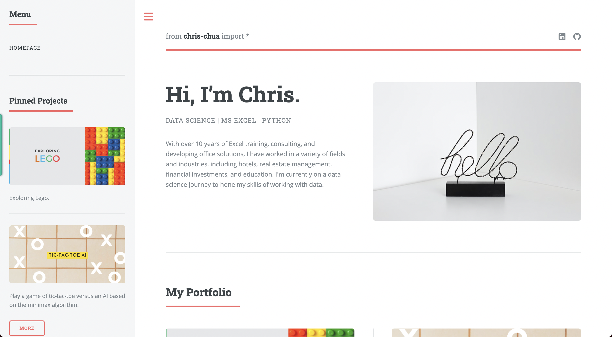

# My Github Page
> A site showcasing my projects.
> Live site [_here_](https://chuawt.github.io).

## Table of Contents
* [Screenshots](#screenshots)
* [Project Status](#project-status)
* [To Do](#to-do)
* [Acknowledgements](#acknowledgements)
* [Contact](#contact)

## Screenshots

## Project Status
Project is: _in progress_

## To Do
- Writeup for Lego exploration project
- Writeup for Tic-Tac-Toe Minimax AI

## Acknowledgements
- This project was based on the [Editorial](https://html5up.net/editorial) HTML template by [HTML5 UP](https://html5up.net/).
- Images courtesy of Unsplash.

## Contact
Created by [@chuawt](https://chuawt.github.io/) - feel free to contact me!